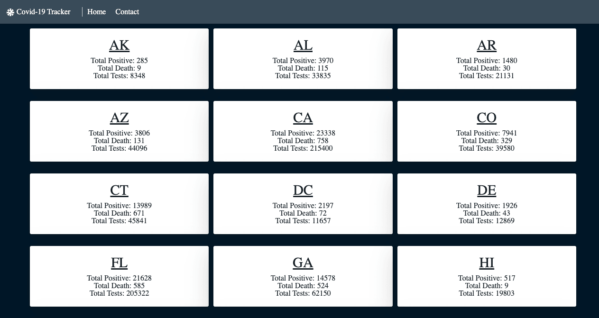

# Basic COVID-19 Tracker

## The goal of this app is to be able to track the current crisis.

- This basic covid-19 tracker was made using Reactjs and Blueprintjs.
- API used is [Covidtracking.com](https://covidtracking.com/api/states)
- It is nothing fancy and I have plans to add more to it, but this gets across the basic info.

